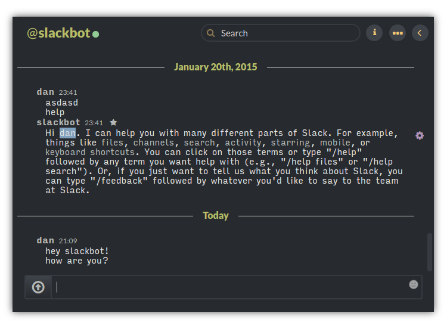

# slack-base16-tomorrow-dark

A flat dark color scheme based off the base16-tomorrow dark color palette. Someday I'll add some more coloration here, but splitting up the selectors will be a lot of work.

Set your Sidebar Theme to this, under Preferences:

    #282A2E,#282A2E,#373B41,#F0C674,#373B41,#E0E0E0,#B5BD68,#CC6666

Thanks to Chris Kempson for the [base16 color palettes](http://chriskempson.github.io/base16/).

Big thanks to Jonathan la Cour for creating the original [Slack Night Mode](https://userstyles.org/styles/101971/slack-night-mode), off which this is functionally based (just the colors changed).

Best served with my other Slack style, [Monospace Font & Condenser for
Slack](https://userstyles.org/styles/108061/monospace-font-condenser-for-slack).

Licensed CC BY-NC-SA 4.0. 2015. Dan Arnold.
